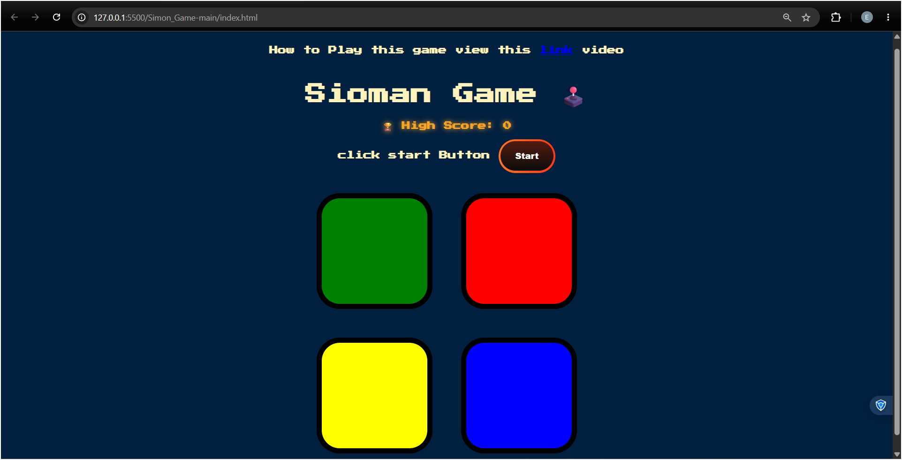

# Simon Game 🎮

An interactive memory game where players must repeat 
a growing sequence of colors and sounds.

## 🚀 Live Demo
[https://suraj-vaishnav18.github.io/Simon_Game/](https://suraj-vaishnav18.github.io/Simon_Game/)

## 📸 Screenshot


## 🎯 How to Play
1. Click the **Start** button to begin
2. Watch the color sequence carefully
3. Repeat the sequence by clicking the colored buttons
4. Each level adds one more step to the sequence
5. Wrong click = Game Over!

## ✨ Features
- Random color sequence generation each level
- Sound effects for each color button
- High score tracking
- Game Over animation on wrong input
- Fully responsive design

## 🛠️ Tech Stack
- HTML
- CSS
- JavaScript
- jQuery

## ⚙️ Installation & Setup
1. Clone the repository
```bash
git clone https://github.com/suraj-vaishnav18/Simon_Game
```
2. Open `index.html` in your browser

That's it — no dependencies needed! ✅

## 📬 Contact
- GitHub: [@suraj-vaishnav18](https://github.com/suraj-vaishnav18)
- Email: surajvaishnav2677@gmail.com
